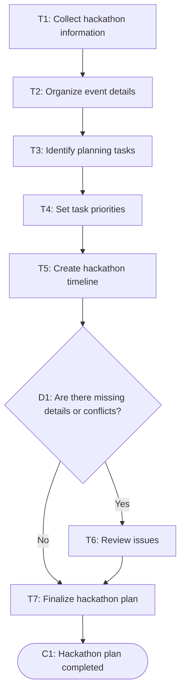

# Workflow of Tasks

*Replace all bracketed prompts with information specific to your proposed system. Delete instructional text that does not belong in your final specification. Add or remove task sections as needed. Every task shown in the general workflow must have a corresponding task specification below.*

## 1. Workflow Overview
### 1.1 Workflow Goal
This workflow supports the system goal defined in `my_first_agent/README.md`.

### 1.2 Workflow Trigger

The workflow starts when a hackathon organizer enters information about a hackathon and wants help keeping track of the planning process, tasks, and deadlines.

### 1.3 Completion Condition at Runtime

The workflow is complete when HackTrack has put together a hackathon plan with the main tasks, deadlines, and responsibilities organized and has identified anything that still needs to be reviewed by humans.

### 1.4 General Workflow

HackTrack starts by collecting the information provided about the hackathon, like important dates, requirements, tasks, and responsibilities. It then organizes the information and identifies the main tasks that need to be completed before the event. The system puts these tasks in order based on their deadlines and what needs to be done first.

After creating the timeline, HackTrack checks for missing information, conflicts, or deadlines that may not be realistic. If a problem comes up, it sends it for human review instead of making the decision on its own. Once everything is reviewed, the system creates the final hackathon plan that can be used to keep track of progress.

### 1.5 Workflow Diagram

[Insert a flowchart showing the tasks in sequence. Label each task with a task number and short name. Show decision branches, loops, review points, and possible stopping conditions. Below is an example of a Mermaid. You can either edit the mermaid below yourself or ask ChatGPT to generate a Mermaid script based on your workflow description above. Give every task a unique ID, such as T1, T2, and T3, and name tasks using a verb and an object in the mermaid.]

