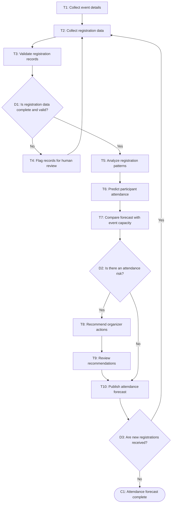

# Workflow of Tasks

*Replace all bracketed prompts with information specific to your proposed system. Delete instructional text that does not belong in your final specification. Add or remove task sections as needed. Every task shown in the general workflow must have a corresponding task specification below.*

## 1. Workflow Overview
### 1.1 Workflow Goal
This workflow supports the system goal defined in `my_first_agent/README.md`.

### 1.2 Workflow Trigger

The workflow starts when a hackathon organizer creates an event and opens registration, or when new registration information is submitted.

### 1.3 Completion Condition at Runtime

The workflow is complete when HackTrack has produced an attendance forecast, identified registration trends or risks, and provided recommended actions for human review.

### 1.4 General Workflow

HackTrack begins by collecting hackathon details and participant registration information, such as the event date, location, capacity, registration date, participant background, and registration status. The system validates the registration data and checks for missing, duplicate, or inaccurate entries. If information is incomplete or conflicts with existing records, HackTrack flags it for human review instead of making assumptions.

Once the data is validated, HackTrack analyzes registration patterns to estimate how many registered participants are likely to attend. The forecast may consider factors such as registration timing, confirmation status, previous event attendance, event format, and cancellation history when available. HackTrack then compares the predicted attendance with the event’s capacity and planning requirements. If the prediction shows risks, such as low attendance, likely overcrowding, or a high number of unconfirmed registrants, it recommends actions such as sending reminders, opening a waitlist, adjusting food orders, or increasing outreach.

Finally, the organizer reviews the forecast and recommendations. After review, HackTrack publishes the attendance prediction and keeps monitoring registration updates until the event.

### 1.5 Workflow Diagram

[Insert a flowchart showing the tasks in sequence. Label each task with a task number and short name. Show decision branches, loops, review points, and possible stopping conditions. Below is an example of a Mermaid. You can either edit the mermaid below yourself or ask ChatGPT to generate a Mermaid script based on your workflow description above. Give every task a unique ID, such as T1, T2, and T3, and name tasks using a verb and an object in the mermaid.]

